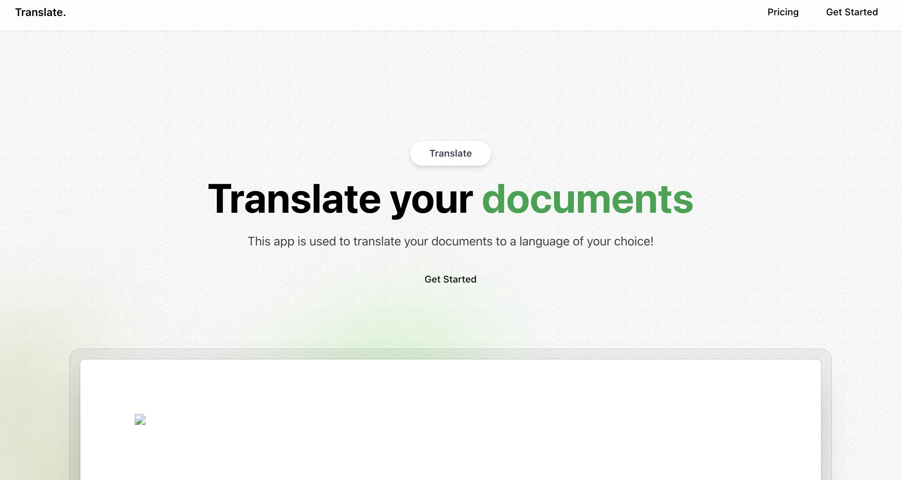

## PDF-app

PDF translation web app using next.js

## Getting Started

this project uses npm as the main package manager, please feel free to use a different one.

First, run the development server:

`npm run dev`

Second, run the convex dev server:

`npx convex dev`

Keep both running simultaneous. 

Open [http://localhost:3000](http://localhost:3000) with your browser to see the result.
